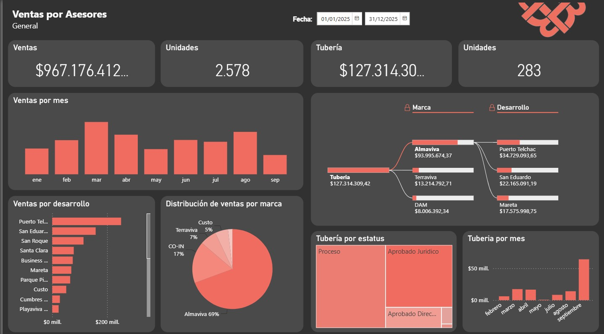
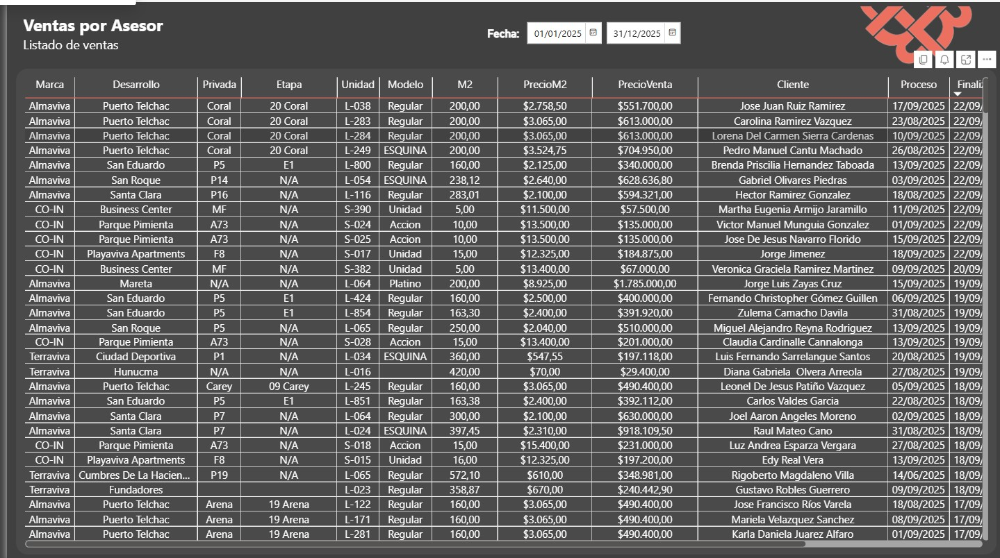

# Web App Embed de Dashboard de Ventas por Asesor

La idea del proyecto es recrear lo que antes era un dashboard de power bi en apps cript usando APACHE ECHARTS como renderizador de gráficos.
Originalmente se tenían muchos informes pbix publicados como app web y que consumían la base de datos con cada actualización, provocando lentitud en el sistema.

Mi intención es tener un solo dashboard en appscript que se pueda filtrar de forma dinámica por asesor, ya un asesor no debe de ver datos de otros asesores.
Es importante que analises esta idea del proyecto para verificar la ruta y los cambios más adecuados para poder aplicarlo al producto final.

## Estructura del proyecto

```PowerShell
dashboard-ventas-asesores/
│   .gitignore
│   LICENSE
│   README.md
│
├───.vscode
│       settings.json
│
├───app
│   │   .claspignore
│   │   appsscript.json
│   │   jsconfig.json
│   │   package-lock.json
│   │   package.json
│   │
│   ├───components
│   │       sidebar.html
│   │
│   ├───img
│   ├───node_modules
│   │
│   ├───scripts
│   │       script_sidebar.html
│   │
│   ├───src
│   │       cache.js
│   │       charts.js
│   │       config.js
│   │       drive.js
│   │       webapp.js
│   │
│   ├───styles
│   │       styles_sidebar.html
│   │
│   └───views
│           index.html
│
├───docs
│   ├───img
│   ├───pdf
│   └───prompt
│           idea-inicial.md
│
└───pipeline
    │   .python-version
    │   main.py
    │   pyproject.toml
    │   README.md
    │
    ├───.venv
    │
    ├───config
    │       .env
    │
    ├───data
    │       ventas_agrupadas.sql
    │       ventas_desglosadas.sql
    │
    └───src
            bigquery_client.py
            config.py
            core.py
            drive_client.py
            pipeline.py
            token_manager.py
```

## App: Proyecto Clasp

### Data

Mi idea es tener dos fuentes de datos en formato json.

1. Fuente de datos agrupada

   Tener una fuente de datos agruapda me permitiría tener algo así.

| Asesor | Marca     | Desarrollo  | Unidades | PrecioVenta | Fecha mes-año truncada dia 1 | Estatus    |
| ------ | --------- | ----------- | -------- | ----------- | ---------------------------- | ---------- |
| Yendri | Almvaviva | Santa Clara | Sum()    | Sum()       | 01/07/2026                   | Finalizado |
| Yendri | Almaviva  | Santa Clara | Sum()    | Sum()       | 01/07/2026                   | Proceso    |
| Yendri | Almaviva  | Santa Clara | Sum()    | Sum()       | 01/06/2026                   | Finalizado |
| Ivan   | Almaviva  | San Eduardo | Sum()    | Sum()       | 01/06/2026                   | Finalizado |

Esta fuente de datos agrupada me serviría para alimentar el front end del dashboard.
Ya que queremos reducir la cantidad de filas de datos que lee para hacer el renderizado más optimizado y no consumir mucho espacio en cache, tiempo de ejecucion y

2. Fuente de datos desglosada.

   Aquí tendría un archivo en formato json con el total de las ventas una por una para que los vendedores puedan visualizar la data individual y filtrarla.
   Las ventas se verían algo así

| Asesor | Marca     | Desarrollo  | Unidad | PrecioVenta | Fecha Completa | Estatus    |
| ------ | --------- | ----------- | ------ | ----------- | -------------- | ---------- |
| Yendri | Almvaviva | Santa Clara | L-001  | $1000       | 10/07/2026     | Finalizado |
| Yendri | Almaviva  | Santa Clara | L-002  | $1100       | 09/07/2026     | Proceso    |
| Yendri | Almaviva  | Santa Clara | L-003  | $1100       | 07/06/2026     | Finalizado |
| Ivan   | Almaviva  | San Eduardo | L-001  | $2000       | 05/06/2026     | Finalizado |

### Frontend: Vista Dashboard

Esta vista del frontend se debe poder filtrar por fecha. Usando la fecha mes año, usariamos un calendario
Esta es una descripción de cómo se vería el Dashboard usando como referencia la imagen

Vista previa:


| Zona      | Area             | Widet                         | KPI                                                      | Hover                             |
| --------- | ---------------- | ----------------------------- | -------------------------------------------------------- | --------------------------------- |
| Izquierda | Arriba izquierda | Tarjeta                       | Suma de Ventas finalizadas                               | Ninguno                           |
| Izquierda | Arriba derecha   | Tarjeta                       | Suma de Unidades finalizadas                             | Ninguno                           |
| Izquierda | Centro           | Barras de abajo a arriba      | Suma de ventas finalizadas por mes-año                   | Unidades y Precio de venta        |
| Izquierda | Abajo izquierda  | Barras de izquierda a derecha | Suma de ventas por desarrollo                            | Unidades y Precio de venta        |
| Izquierda | Abajo derecha    | Pastel                        | Suma de ventas por marca                                 | Marca, Unidades y Precio de venta |
| Derecha   | Arriba izquierda | Tarjeta                       | Suma de ventas NO finalizadas                            | Ninguno                           |
| Derecha   | Arriba derecha   | Tarjeta                       | Suma de unidades no finalizadas                          | Ninguno                           |
| Derecha   | Centro           | Arbol horizontal              | Desglose de ventas no finalizadas por marca y desarrollo | Unidades y Precio de venta        |
| Derecha   | Abajo izquierda  | Area                          | Estatus de ventas no finalizadas                         | Unidades y Precio de venta        |
| Derecha   | Abajo derecha    | Barras de abajo a arriba      | Suma de ventas no finalizadas por mes                    | Unidades y Precio de venta        |

### Frontend: Vista de lista en tabla.

Esta vista debe de traer los datos subyacientes. Es decir, un listado con todas las ventas del asesor. No hace falta filtrar esta data más que con un calendario similar al anterior. Lo importante paginarla si los datos pasan de más de 30 filas.

Vista previa:


### Frontend: Navegacion

Debe de haber un botón que me permita navegar entre la vista del tablero con gráficos y una vista que muestre los datos en un listado de tabla. La navegación puede ser con un mini sidebar o con un navbar ajustado a las dimensiones del tablero. No debe ser estorboso.
Debe de poder permitirme ir y venir entre el tablero y los datos en listado.

### Backend: Filtro por URL

Esta es la parte más importante: Los datos se deben poder filtrar por URL usando un token por asesor.
La intención de esto es que pueda hacer varios links para embeberlo en una página diferente para cada asesor.
Cada token debe de filtrar los datos de un solo asesor al cual se le relaciona. El filtro se debe de poder aplicar desde el url.

### Backend: Session Sotarage y Cache

Al tener el mismo dashboard en el mismo url, solo que filtrado, pues la idea es que el primer usuario que ingrese a su link cargue todos los datos y almacene en cache. El frontend solo se alimentará con los datos filrtados, no debe de servirse data que no pertece desde el backend, así que el backend debe de procesar esta data una vez y servir la correcta al frontend.

Al almacenar en cache, si otro usuario entra los datos ya estarán cargados en cache, asi el back solo filtra usando el url y serán menos consultas a la cuota de appscript.

## Pipeline: Proyecto Python

Esta parte del proyecto debe ser orquestrada por medio de una pipeline de ejecución local para almacenar y actualizar datos en una carpeta de drive.

### Origen de los datos

El origen de los datos vendrá de un proyecto institucional de bigquery, por lo que el proyecto solo se puede consumir por python a traves de mis credenciales en un archivo .json
Para ejecutar las consultas, pienso usar la query que almacenaré en data/ y pasarle eso al bigquery_client.py
La idea es que se ejecute la query y procesar la data limpia y homologada.

El drive_client.py debe de almacenar archivos json:

- ventas_agrupadas.json:
  Este archivo debe tener la data para que se consuma en el frontend del dashboard, en la vista de tablero.
- ventas_desglosadas.json
  Este archivo debe tener la data para que se consuma en el frontend en la vista de tabla listada.
- config.json
  Este archivo es importante, porque tendrá la serialización de los tokens para que se filtren los asesores de ventas y sepa el backend cómo fitrar los datos.

### Tokens

Los tokens que filtrará la infomración se deben generar de forma dinámica, pero no deben de reemplazarse con cada ejecución. Solo debe actualizar en caso de que se agregue un asesor nuevo.
La idea es que python revise si hay un nuevo asesor sin token y lo guarde en el cofig.json, si no hay pues no cambia nada. Se debe evitar hacer varias implementaciones de la app en un corto periodo de tiempo, por lo que es importante no cambiar los tokens.
